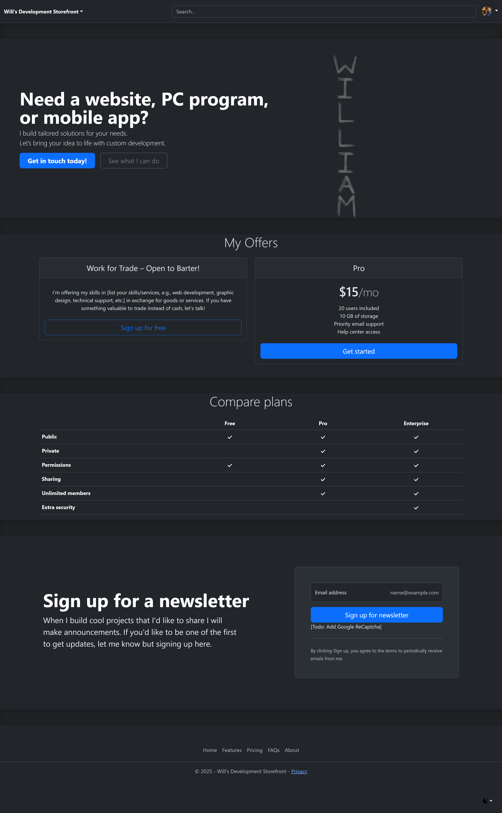

# My Personal eCommerceSite
 
The purpose of this website is to get used to Bootstrap, and I have found that I really like their [examples pages](https://getbootstrap.com/docs/5.3/examples/).

I use a technique to look at the DOM through dev tools and I can extract the bootstrap examples and work with them ( via copy < copy outerHTML )

Previously I have been on-the-fence about style libraries because I only looked at their building blocks, the _css classes_. But I have always been conflicted about putting styles and mark-up in the same files. I prefer a separation of concerns. However I got used to the bootstrap building blocks, and I could see their benefits, such as setting consistent margins and sizes, etc. 

The examples section is really a game changer because it shows you many options to start with. 

I'll probably turn this into a real eCommerceSite in the future. But I have to figure out what to sell first. I also need to figure out how to manage the "inventory" or "schedule" for services.

I am really happy about the Bootstrap break through, and will use this technique with any style library to get my projects started. I also look forward to style consistency across multiple browsers because I have had issues in the past with Safari browsers, since I program on a PC. Safari uses a completely different rendering engine the other modern browsers. 

# Prerequisites to run the project locally

- VS and the ASP.NET MVC Workload
  
